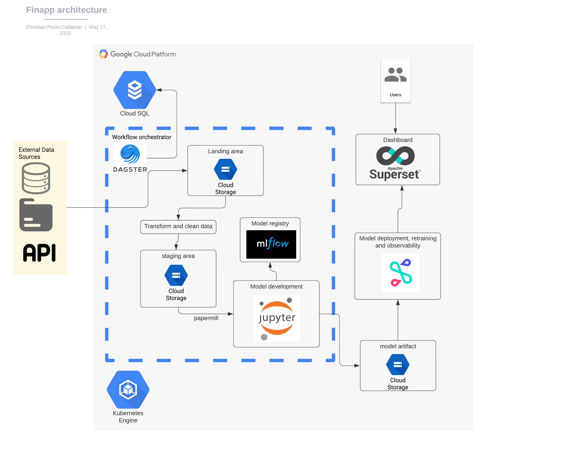

# finapp

Welcome to your finapp repository.

### Contents

| Name | Description |
|-|-|
| `config/` | directory that contains the config files for deployment regarding to the enviroment |
| `finapp/` | A Python module that contains code of finapp application |
| `finapp_tests/` | A Python module that contains tests for `finapp` |
| `workspace.yaml` | A file that specifies the location of the user code for Dagit and the Dagster CLI |
| `README.md` | A description and guide for this code repository |
| `setup.py` | A build script with Python package dependencies for this code repository |

## Getting up and running

1. Install docker tool.

**Pyenv**
```bash
export PYTHON_VERSION=3.9.6
pyenv install $PYTHON_VERSION
pyenv virtualenv $PYTHON_VERSION app
pyenv activate app
```

**Conda**
```bash
export PYTHON_VERSION=X.Y.Z
conda create --name app python=PYTHON_VERSION
conda activate app
```

2. Once you have activated your Python environment, install your repository as a Python package. By
using the `--editable` flag, `pip` will install your repository in
["editable mode"](https://pip.pypa.io/en/latest/reference/pip_install/?highlight=editable#editable-installs)
so that as you develop, local code changes will automatically apply.

```bash
pip install --editable .
```

## Local Development

1. Set the `DAGSTER_HOME` environment variable. Dagster will store run history in this directory.

```base
mkdir ~/dagster_home
export DAGSTER_HOME=~/dagster_home
```

2. Start the [Dagit process](https://docs.dagster.io/overview/dagit). This will start a Dagit web
server that, by default, is served on http://localhost:3000.

```bash
dagit
```

3. (Optional) If you want to enable Dagster
[Schedules](https://docs.dagster.io/overview/schedules-sensors/schedules) or
[Sensors](https://docs.dagster.io/overview/schedules-sensors/sensors) for your pipelines, start the
[Dagster Daemon process](https://docs.dagster.io/overview/daemon#main) **in a different shell or terminal**:

```bash
dagster-daemon run
```

## Local Testing

Tests can be found in `finapp_tests` and are run with the following command:

```bash
pytest finapp_tests
```

As you create Dagster solids and pipelines, add tests in `finapp_tests/` to check that your
code behaves as desired and does not break over time.

[For hints on how to write tests for solids and pipelines in Dagster,
[see our documentation tutorial on Testing](https://docs.dagster.io/tutorial/testable).

## General architecture

.
