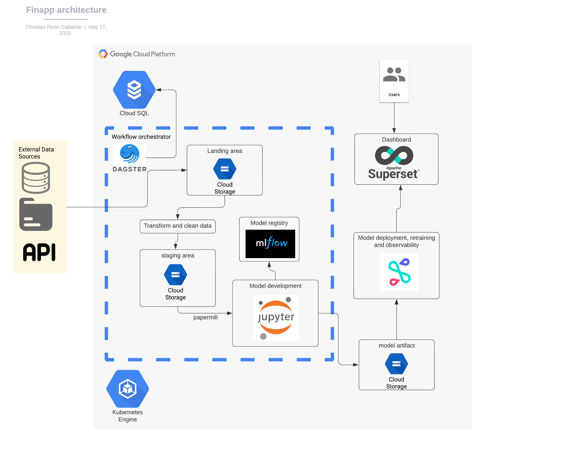

# finapp

Welcome to your finapp repository.

### Contents

| Name | Description |
|-|-|
| `config/` | directory that contains the config files for deployment regarding to the enviroment |
| `finapp/` | A Python module that contains code of finapp application |
| `finapp_tests/` | A Python module that contains tests for `finapp` |
| `README.md` | A description and guide for this code repository |
| `setup.py` | A build script with Python package dependencies for this code repository |


## General architecture

.

## Prerequisites
 * Docker
 * get sandbox_api_key by open an account in [finhub](https://finnhub.io/)
 * SQL postgres intance (Cloud deployment)
 * Storage GCP instance (Cloud deployment)

## How to use FOR Cloud deployment in GCP 
 * create a .env-non-dev  file in the /config/cloud_docker/ folder with this env variables.
```Bash
FINNUB_KEY=your_sandbox_api_key
DAGSTER_PG_USERNAME=<admin_db_name>
DAGSTER_PG_PASSWORD=<admin_db_pwd>
DAGSTER_PG_HOST=<ip addreess> #ip statica address of your SQL postgres instance in GCP
DAGSTER_PG_DB=<db_name>
DAGSTER_PG_OP_DB=<db_operational_db>
DAGSTER_PG_OP_DB_PORT=5432 #no modify this
DAGSTER_CURRENT_IMAGE=christianpiconc/finapp_pipelines_non_dev #no modify this
GOOGLE_APPLICATION_CREDENTIALS=/var/keyfile.json # you must to have the keyfile of your service account
```
 * pull the container images with `docker-compose -f docker-compose-non-dev.yml --env-file ./config/cloud_docker/.env-non-dev pull`
 * Run the container with `docker-compose -f docker-compose-non-dev.yml --env-file ./config/cloud_docker/.env-non-dev up -d`
   * If you want it running in the background, use `docker compose up -d`

## How to use FOR Local deployment 
 * create a .env  file in the /config/local_docker/ folder with this env variables.
```Bash
FINNUB_KEY=your_sandbox_api_key
DAGSTER_PG_USERNAME=dagster
DAGSTER_PG_PASSWORD=dagster1234
DAGSTER_PG_HOST=finapp_db_backend
DAGSTER_PG_DB=backend_dagster
DAGSTER_PG_OP_DB=finapp_op_db
DAGSTER_PG_OP_DB_PORT=5433
DAGSTER_CURRENT_IMAGE=finapp_pipelines
GOOGLE_APPLICATION_CREDENTIALS=/var/keyfile.json # you must to have the keyfile of your service account
```
 * run the container images with `docker-compose  --env-file ./config/local_docker/.env up -d`
